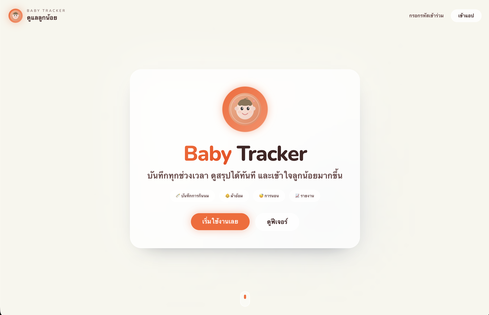
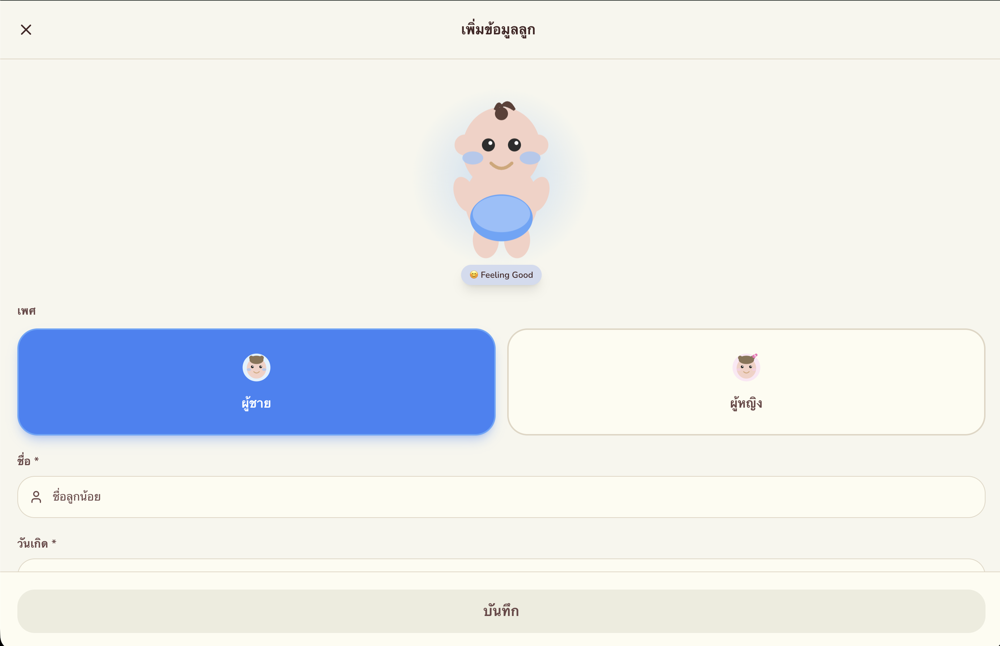
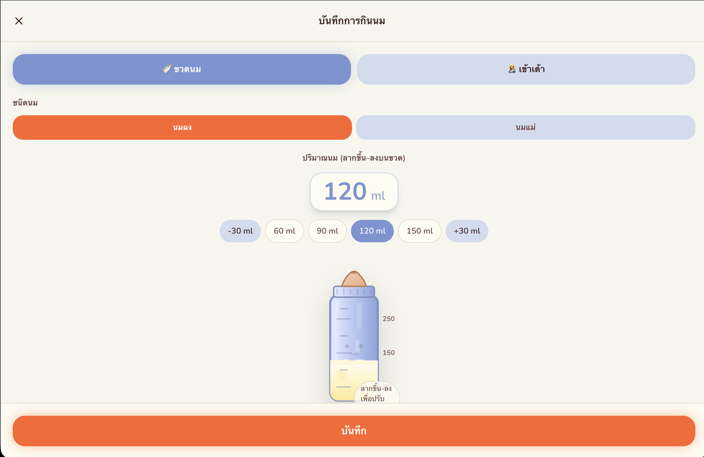

<p align="center">
  
  
  
  
  
  
  
</p>

<h1 align="center">👶 Baby Tracker — บันทึกการดูแลลูกน้อย</h1>

<p align="center">
  ระบบบันทึกการดูแลทารกแบบครบวงจร สำหรับพ่อแม่และผู้ดูแล<br/>
  พร้อมระบบเชิญผู้ดูแลร่วมและสรุปสถิติอัตโนมัติ
</p>

<p align="center">
  <a href="https://baby-tracker-ten-sand.vercel.app"></a>
  <a href="https://workers.cloudflare.com"></a>
  <a href="https://github.com/Nut-Natthawut/baby-tracker/actions"></a>
  <a href="https://gitlab.com/baby_tracker/baby_tracker"></a>
</p>

---

## 📋 Overview

**Baby Tracker** is a modern web application designed for parents and caregivers to efficiently track and manage their baby's daily activities. It provides a seamless, collaborative experience for logging feedings, diaper changes, and sleep schedules — complete with insightful statistical summaries.

**Key workflow:**
1. **Authentication:** Secure login and registration with JWT-based sessions.
2. **Activity Logging:** Quick, intuitive entry for feeding (breast milk / formula), diaper changes, and sleep duration.
3. **Collaboration:** Parents can invite other caregivers (e.g., nannies, grandparents) to co-manage the baby's logs.
4. **Data Visualization:** The dashboard automatically aggregates and displays daily/weekly stats.

---

## � Screenshots

<p align="center">
  
  <br/><em>Landing Page — หน้าแรกของแอปพลิเคชัน</em>
</p>

<p align="center">
  
  &nbsp;&nbsp;
  
</p>
<p align="center">
  <em>เพิ่มข้อมูลลูก</em> &nbsp;&nbsp;&nbsp;&nbsp;&nbsp;&nbsp;&nbsp;&nbsp;&nbsp;&nbsp;&nbsp;&nbsp;&nbsp;&nbsp;&nbsp;&nbsp;&nbsp;&nbsp;&nbsp;&nbsp;&nbsp;&nbsp;&nbsp;&nbsp;&nbsp;&nbsp;&nbsp;&nbsp;&nbsp;&nbsp;&nbsp;&nbsp;&nbsp;&nbsp;&nbsp;&nbsp;&nbsp;&nbsp;&nbsp;&nbsp;&nbsp;&nbsp;&nbsp;&nbsp;&nbsp;&nbsp;
  <em>บันทึกการกินนม</em>
</p>

---

## �👥 Team Contributions

This project was developed collaboratively by a team of **3 members** for a university DevOps coursework.

| Member | Role | Key Responsibilities |
|---|---|---|
| **Nut-Natthawut** | Backend Developer / DevOps Engineer | • Architected serverless backend using **Hono** + **Cloudflare Workers** + **D1**<br/>• Designed database schema with **Drizzle ORM** and wrote migrations<br/>• Implemented **JWT Authentication** with access & refresh tokens<br/>• Built the full **CI/CD pipeline** (GitHub Actions ↔ GitLab sync, auto MR creation)<br/>• Configured deployment: **Vercel** (frontend) + **Cloudflare Workers** (backend)<br/>• Managed version control strategy and repository mirroring |
| **taechonlakon** | Frontend Developer / UI Designer | • Designed and implemented the **Landing Page** with modern UI/UX<br/>• Built core baby tracking UI: **BabySwitcher**, **SleepModal**, and activity logging components<br/>• Implemented the **Authentication & Invitation UI** system<br/>• Developed **SettingsModal**, **ThemeToggle**, and accessibility enhancements<br/>• Created reusable **shadcn/ui** components and Tailwind CSS styling system<br/>• Integrated frontend with backend API for baby management and activity features |
| **Khwanchanok Sawangned** | Business Analyst (BA) | • Gathered and analyzed project requirements from stakeholders<br/>• Created user stories, use cases, and acceptance criteria<br/>• Designed application workflow and user journey mapping<br/>• Coordinated between team members to ensure feature alignment<br/>• Documented functional specifications and project deliverables |

---

## ✨ Features

| Feature | Description |
|---|---|
| 🍼 **Feeding Logs** | Track breast milk and formula feeding times and quantities |
| 🧷 **Diaper Tracking** | Log diaper changes with type (wet/dirty) and timestamps |
| 😴 **Sleep Scheduler** | Record sleep start/end times with total duration calculation |
| 📊 **Dashboard Stats** | Visual summaries of daily activities for easy pattern recognition |
| 👨‍👩‍👧 **Caregiver Invites** | Share access with family members to collaborate on the baby's profile |
| 🔐 **Secure Auth** | Stateless JWT authentication with refresh token rotation |

---

## 🏗️ Architecture

```text
┌──────────────────────────────┐     ┌──────────────────────────────┐
│         FRONTEND             │     │          BACKEND             │
│                              │     │                              │
│  React 18 & TypeScript       │────▶│  Hono Web Framework          │
│  Vite Build Tool             │     │  Cloudflare Workers (Edge)   │
│  Tailwind CSS & shadcn/ui    │     │  Cloudflare D1 (SQLite)      │
│                              │     │  Drizzle ORM                 │
│                              │     │                              │
└──────────────────────────────┘     └──────────────────────────────┘
```

### Tech Stack Breakdown

| Layer | Technology | Purpose |
|---|---|---|
| **Frontend** | React 18, Vite, Tailwind CSS, shadcn/ui | High-performance UI Components, Routing, and Styling |
| **Backend** | Hono, Cloudflare Workers | Serverless Edge API layer for ultra-fast global responses |
| **Database** | Cloudflare D1, Drizzle ORM | Distributed SQL Database (SQLite) and Type-safe ORM |
| **Security** | JWT (JSON Web Tokens) | Stateless Authentication with Refresh Token rotation |
| **DevOps** | GitHub Actions, GitLab CI/CD, Vercel | Automated CI/CD pipelines, mirroring, and Edge deployment |

---

## 🗂️ Project Structure

```text
baby-tracker/
├── client/                      # Frontend (React + Vite)
│   ├── public/                  # Static Assets (favicon, og-image)
│   ├── src/
│   │   ├── components/          # Reusable React UI Components (shadcn/ui)
│   │   ├── context/             # Global State Management (AuthContext)
│   │   ├── hooks/               # Custom React Hooks
│   │   ├── pages/               # Page/View Components (Dashboard, Logs)
│   │   ├── lib/                 # Core utilities
│   │   └── App.tsx              # Main Application Entry
│   ├── tailwind.config.ts       # Tailwind CSS design system settings
│   ├── vite.config.ts           # Vite bundler configuration
│   └── package.json             # Frontend dependencies
│
├── server/                      # Backend (Hono + Cloudflare Workers)
│   ├── drizzle/                 # Database Migrations (SQL)
│   ├── src/
│   │   ├── db/                  # Database Schema Definitions (Drizzle ORM)
│   │   ├── routes/              # API Endpoints (auth, users, logs)
│   │   └── index.ts             # Hono Worker Entry Point
│   ├── wrangler.jsonc           # Cloudflare Worker & D1 Configuration
│   └── package.json             # Backend dependencies
│
├── .github/workflows/           # GitHub Actions (GitLab sync + auto MR)
├── .gitlab-ci.yml               # GitLab CI/CD pipeline
└── COLLABORATION.md             # Collaboration guidelines
```

---

## 🚀 Getting Started

### Prerequisites

- **Node.js** ≥ 18
- **npm** ≥ 9
- **Wrangler CLI** (for Cloudflare local development)

### 1. Clone the repository

```bash
git clone https://github.com/Nut-Natthawut/baby-tracker.git
cd baby-tracker
```

### 2. Frontend Setup

```bash
cd client
npm install

# Create environment config
echo "VITE_API_URL=http://127.0.0.1:8787" > .env

# Run development server
npm run dev
```

The frontend will be available at `http://localhost:5173`

### 3. Backend Setup

Open a new terminal window:

```bash
cd server
npm install

# Apply database migrations to local D1 instance
npx wrangler d1 migrations apply baby-tracker-db --local

# Run Cloudflare local worker
npm run dev
```

The backend API will be available at `http://127.0.0.1:8787`

---

## 📦 Deployment

### Frontend → Vercel

1. Push code to GitHub.
2. Import the project into [Vercel](https://vercel.com/).
3. Set **Root Directory** to `client`.
4. Add Environment Variable: `VITE_API_URL` → your deployed Cloudflare Worker URL.
5. Click **Deploy**.

### Backend → Cloudflare Workers

```bash
cd server
npx wrangler login
npx wrangler d1 migrations apply baby-tracker-db --remote
npm run deploy
```

---

## 🛡️ Security

- **Edge JWT Authentication** — Fast, stateless token validation on Cloudflare Edge locations worldwide.
- **Refresh Token Rotation** — Seamless session renewal with enhanced security.
- **CORS Protection** — API endpoints restricted to assigned origin domains only.
- **Backend Validation** — Server-side input validation ensuring data integrity.

---

<p align="center">
  Built with ❤️ using React, Hono, and Cloudflare
</p>
